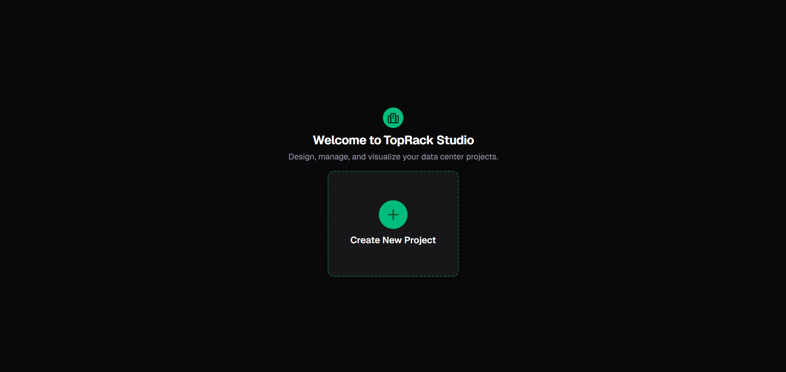

# 🚀 TopRack Studio

**Design, manage, and visualize your data center projects with ease.**

---

[](./assets/)

---

## ✨ What is TopRack Studio?

TopRack Studio is a modern, immersive platform for designing made-to-order data centers. Whether you're planning a new facility or optimizing an existing one, TopRack Studio empowers you to:

- **Configure and visualize data center layouts** interactively on the web or in VR
- **Drag and drop equipment modules** and services (remote monitoring, cybersecurity, predictive maintenance, etc.)
- **Manage constraints** for networking, cooling, electricity, and processing
- **Validate your design** against customizable rulesets
- **Collaborate and store designs** securely in the cloud

---

## 🖥️ Features

- **Modern Web Editor**: Intuitive, responsive UI built with Vite, Vue 3, and Tailwind CSS
- **Immersive VR Experience**: Define your data center's room shape and place modules in virtual reality
- **CSV-Driven Rule Engine**: Easily extendable constraints and modules—just upload new CSVs, no code changes needed
- **Real-Time Feedback**: Instantly see constraint violations and optimization suggestions
- **Cloud-Backed Storage**: All your designs are safely stored and accessible from anywhere
- **Component Library**: Drag and drop from a rich library of Siemens and custom modules
- **Spec Checker**: Validate your design against all requirements at a glance

---

## 🛠️ Tech Stack

- **Frontend**: Vite, Vue 3, TypeScript, Pinia, Vue Router, DaisyUI, Tailwind CSS, VueUse
- **Backend**: Django (REST API)
- **State Management**: Jotai, React Query (for data fetching)
- **Visualization**: Leaflet (for 2D), WebXR (for VR)

---

## 🚦 Quick Start

1. **Clone the repository**
   ```bash
   git clone https://github.com/your-org/toprack-studio.git
   cd toprack-studio/web
   ```
2. **Install dependencies**
   ```bash
   npm install
   ```
3. **Start the development server**
   ```bash
   npm run dev
   ```
4. **Open in your browser**
   Visit [http://localhost:5173](http://localhost:5173)

---

## 🧩 How It Works

- **Create a Project**: Name your project, select or upload module libraries and rulesets (CSV), and set your preferred units.
- **Scan Your Room (VR)**: Define your data center's shape in VR for a realistic, spatially accurate design.
- **Design & Validate**: Drag modules into your layout, see real-time feedback, and ensure all constraints are met.
- **Collaborate & Iterate**: All changes are saved in the cloud, so you can collaborate and refine your design anytime.

### Visual Guide

<p align="center">
  
  <br/>
  <em>Figure 1: Interactive data center layout with modules and constraints visualization</em>
</p>

<p align="center">
  
  <br/>
  <em>Figure 2: Welcome screen with quick access to recent projects and templates</em>
</p>

<p align="center">
  
  <br/>
  <em>Figure 3: Project setup wizard for configuring initial parameters and constraints</em>
</p>

<p align="center">
  
  <br/>
  <em>Figure 4: Create new project dialog with advanced configuration options</em>
</p>

<p align="center">
  
  <br/>
  <em>Figure 5: Customizable measurement units and conversion settings</em>
</p>

---

## 📸 Screenshots

<p align="center">
  
  
</p>

---

## 📚 Extending TopRack Studio

- **Add new modules or constraints** by uploading new CSVs—no code changes required!
- **Customizable units** for distance, currency, water, and power
- **Flexible room shapes**: define any polygonal room in VR, mapped to rectangular constraints for validation

---

## 💡 Inspiration

TopRack Studio was built for the Siemens Energy challenge at the 2025 HackUPC hackathon to revolutionize how clients design and optimize data centers—bridging the gap between real-world spatial design and robust, data-driven constraint logic.

---

<p align="center">
  <b>Design smarter. Visualize better. TopRack Studio.</b>
</p>
