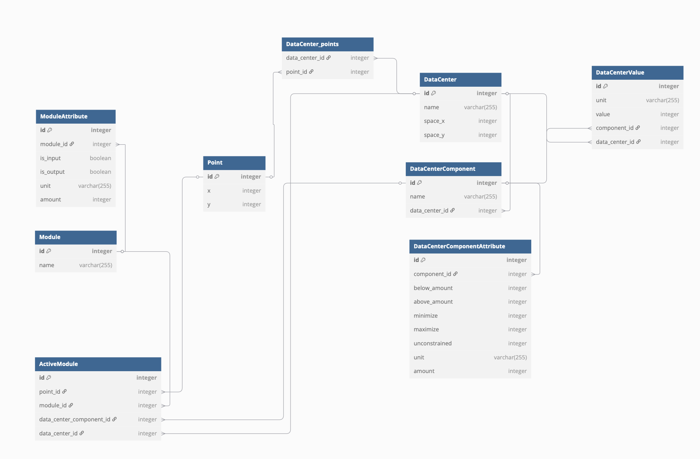

## Development Setup

### Dependencies

This project uses `uv` for Python dependency management. To set up the project:

1. Install dependencies:

   ```
   uv sync
   ```

2. Run the development server:

   ```
   uv run python manage.py runserver
   ```

3. Import initial data (optional):

   ```
   uv run python manage.py import_from_csv --init-values
   ```

### Development Commands

For development purposes, you can use the following command to reset the database and import fresh data:

```
uv run python manage.py import_from_csv --init-values
```

This command:

- Cleans the database (removes existing modules, components, and values)
- Imports modules from the CSV files in the repo (example files)

**Note:** This is primarily for development purposes. In production, you should use the API endpoints to create and manage data centers.

## Complete Workflow Guide

### 1. Create a Data Center

First, create a data center using one of these methods:

**Option A: Create via API endpoint**

```
POST /api/create-data-center/
```

Example request with just a name (uses default CSV files):

```json
{
  "name": "My Custom Data Center"
}
```

Example request with custom CSV files:

```
# Using form-data
name: My Custom Data Center
modules_csv: [file upload]
components_csv: [file upload]
clean_db: false  # Optional, set to true to clean database before import
```

Parameters:

- `name` (string): Name of the data center
- `modules_csv` (file): CSV file containing module definitions
- `components_csv` (file): CSV file containing component specifications
- `clean_db` (boolean): Whether to clean the database before import (default: false)

The CSV files should follow the format of the example files in the repository:

- Modules CSV: Name, Unit, Amount, Is_Input, Is_Output
- Components CSV: Name, Unit, Amount, Below_Amount, Above_Amount, Minimize, Maximize, Unconstrained

**Option B: Initialize from existing components**

```
POST /api/initialize-values-from-components/
```

Both methods will create a default rectangular data center with dimensions 0x0. This is not good, it shall be overwritten always with next step.

### 2. Define Data Center Boundary

Update the data center boundary points to create a custom shape:

```
POST /api/datacenters/{id}/update_points/
```

Example request:

```json
{
  "points": [
    { "x": 0, "y": 0 },
    { "x": 1000, "y": 0 },
    { "x": 1000, "y": 500 },
    { "x": 500, "y": 500 },
    { "x": 0, "y": 500 }
  ]
}
```

The points define a polygon that represents the data center's physical boundary. The order of points matters as they form a connected shape.

### 3. Place Modules

Place modules at specific coordinates within the data center:

```
POST /api/active-modules/
```

Example request:

```json
{
  "module": 1,
  "data_center_component": 1,
  "x": 100,
  "y": 200
}
```

Each module has resource inputs and outputs that affect the overall data center calculations.

### 4. Validate Configuration

After placing modules, validate the configuration:

```
GET /api/calculate-resources/
```

This endpoint:

- Recalculates all resource values based on placed modules
- Checks if component constraints are satisfied
- Returns validation status and any constraint violations

### 5. Adjust Module Positions

You can always update the position of any placed module:

```
PATCH /api/active-modules/{id}/
```

Example request:

```json
{
  "x": 150,
  "y": 250
}
```

Only the x and y coordinates can be changed after a module is placed. The module type and component cannot be changed.

### 6. Remove Modules

If needed, remove modules that are causing constraint violations:

```
DELETE /api/active-modules/{id}/
```

### 7. Revalidate After Changes

After any changes, revalidate the configuration:

```
GET /api/calculate-resources/
```

For more detailed validation information:

```
GET /api/validate-component-values/
```

### 8. Warmth Image Management

The API provides endpoints to upload and retrieve a warmth image for visualization purposes:

**Upload a warmth image:**

```
POST /api/warmth-image/upload/
```

Example request:

```
# Using form-data
image: [file upload]
```

This endpoint stores the image in memory for later retrieval. Only one image can be stored at a time - uploading a new image will replace any previously stored image.

**Retrieve the warmth image:**

```
GET /api/warmth-image/
```

This endpoint returns the most recently uploaded warmth image. If no image has been uploaded, it returns a 404 error.

### 9. Display Control Management

The API provides endpoints to manage which interface (website or VR) should be displaying information:

**Toggle display control:**

```
GET /api/display-control/toggle/
```

This endpoint switches the current display between 'website' and 'vr'. Each call toggles to the other option.

Example response:

```json
{
  "status": "success",
  "status_code": 200,
  "message": "Display control switched to vr",
  "data": {
    "current_display": "vr"
  }
}
```

**Check current display control:**

```
GET /api/display-control/
```

This endpoint returns the current display setting without changing it.

Example response:

```json
{
  "status": "success",
  "status_code": 200,
  "message": "Current display is website",
  "data": {
    "current_display": "website"
  }
}
```

These endpoints help coordinate which interface (website or VR) should be actively displaying information at any given time.

This workflow allows you to iteratively design and optimize your data center layout while ensuring all constraints are satisfied.

## Data Models

The backend uses the following data models to represent the data center configuration:


A little messy :)

### Point

Internal model representing a point in 2D space that can be associated with various objects.

- **Fields**:
  - `x`: X-coordinate
  - `y`: Y-coordinate

### Module

Represents a building block that can be placed in the data center.

- **Fields**:
  - `name`: Name of the module (e.g., "Transformer_100", "Server_Rack")

### ModuleAttribute

Defines the properties of a module, including resources it consumes or produces.

- **Fields**:
  - `module`: Foreign key to Module
  - `unit`: Type of resource (e.g., "Space_X", "Processing", "Usable_Power")
  - `amount`: Quantity of the resource
  - `is_input`: Whether this resource is consumed by the module
  - `is_output`: Whether this resource is produced by the module

### DataCenterComponent

Represents a logical section of the data center (e.g., "Server_Square", "Dense_Storage").

- **Fields**:
  - `name`: Name of the component
  - `data_center`: Foreign key to DataCenter

### DataCenterComponentAttribute

Defines constraints and specifications for a data center component.

- **Fields**:
  - `component`: Foreign key to DataCenterComponent
  - `unit`: Type of resource (e.g., "Space_X", "Processing")
  - `amount`: Base amount of the resource
  - `below_amount`: Whether the value must be less than or equal to this amount (0 or 1)
  - `above_amount`: Whether the value must be greater than or equal to this amount (0 or 1)
  - `minimize`: Whether this value should be minimized (0 or 1)
  - `maximize`: Whether this value should be maximized (0 or 1)
  - `unconstrained`: Whether this value has no constraints (0 or 1)

### ActiveModule

Represents a module placed at specific coordinates in the data center.
Once created, only the position (x, y) can be changed.

- **Fields**:
  - `point`: Foreign key to Point (defines the location)
  - `module`: Foreign key to Module
  - `data_center_component`: Foreign key to DataCenterComponent
  - `data_center`: Foreign key to DataCenter

### DataCenter

Represents a data center configuration.

- **Fields**:
  - `name`: Name of the data center
  - `space_x`: Total available space in X dimension
  - `space_y`: Total available space in Y dimension
  - `points`: Many-to-many relationship with Point (defines the boundary of the data center)

### DataCenterValue

Tracks the current value of a resource for a component.

- **Fields**:
  - `component`: Foreign key to DataCenterComponent (null for global values)
  - `unit`: Type of resource
  - `value`: Current value of the resource
  - `data_center`: Foreign key to DataCenter

## Model Relationships and Logic

1. **Modules and Attributes**:

   - Each `Module` has multiple `ModuleAttribute` records
   - Attributes define what resources a module consumes (`is_input=True`) or produces (`is_output=True`)
   - Example: A transformer module might consume Grid_Connection and produce Usable_Power

2. **Components and Constraints**:

   - Each `DataCenterComponent` has multiple `DataCenterComponentAttribute` records
   - These attributes define constraints (minimum/maximum values) for different resources
   - Example: Server_Square might require Processing >= 1000 and Space_X <= 1000

3. **Active Modules**:

   - When a module is placed, an `ActiveModule` record is created
   - It references both the module type and the component it's placed in
   - The coordinates determine its position in the data center via the `Point` model

4. **Data Center Geometry**:

   - The `DataCenter` model has a many-to-many relationship with `Point`
   - These points define the boundary of the data center
   - The order of points matters for drawing the boundary correctly

5. **Resource Calculation**:

   - `DataCenterValue` records track the current value of each resource
   - When modules are added/removed, these values are recalculated
   - For each component, the system:
     - Adds up all resources produced by modules in that component
     - Subtracts all resources consumed by modules in that component
     - Checks if the resulting values meet the component's constraints

6. **Validation Logic**:

   - For each component, the system checks:
     - `below_amount=1`: Value must be less than or equal to the specified amount
     - `above_amount=1`: Value must be greater than or equal to the specified amount
     - `minimize=1`: Value should be minimized (optimization goal)
     - `maximize=1`: Value should be maximized (optimization goal)
   - If any constraint is violated, validation fails

7. **Special Resources**:
   - `Space_X/Space_Y`: Represent available space (decreases as modules are added)
   - `Price`: Represents total cost (increases as modules are added)
   - `Processing/Data_Storage`: Represent capacity (increases as modules are added)
   - `Grid_Connection/Water_Connection`: Represent resource connections

## API Usage Flow

### Workflow

1. **Create a Data Center**:

   - `POST /api/create-data-center/` with name and optional CSV files
   - This creates a data center with default dimensions 0x0 (from settings)

2. **Define Data Center Boundary** (REQUIRED):

   - `POST /api/datacenters/{id}/update_points/` with boundary points
   - **THIS SHALL BE USED RIGHT AFTER THE CREATION OF DATA CENTER AND BEFORE ANY OTHER LOGIC**

3. **Place Modules**:

   - Get available modules: `GET /api/modules/`
   - Get components: `GET /api/datacenter-components/`
   - Get data center info: `GET /api/datacenters/{id}/`
   - Place modules: `POST /api/active-modules/`

4. **Validate Configuration**:

   - `GET /api/calculate-resources/` for quick validation
   - `GET /api/validate-component-values/` for detailed validation

5. **Adjust as Needed**:
   - Update positions: `PATCH /api/active-modules/{id}/`
   - Remove modules: `DELETE /api/active-modules/{id}/`
   - Revalidate after changes: `GET /api/calculate-resources/`

## API Endpoints Reference

### Core API Endpoints (Production Use)

These endpoints are part of the main workflow and should be used by developers:

#### Data Centers

- `GET /api/datacenters/` - List all data centers

  - Returns: List of all data centers with their properties
  - Example response:
    ```json
    {
      "status": "success",
      "status_code": 200,
      "message": "Data centers retrieved successfully",
      "data": [
        {
          "id": 1,
          "name": "Default Data Center",
          "width": 1000,
          "height": 500,
          "points": [
            { "id": 1, "x": 0, "y": 0 },
            { "id": 2, "x": 1000, "y": 0 },
            { "id": 3, "x": 1000, "y": 500 },
            { "id": 4, "x": 0, "y": 500 }
          ]
        }
      ]
    }
    ```

- `GET /api/datacenters/{id}/` - Get a specific data center

  - Returns: Detailed information about a specific data center
  - Example response:
    ```json
    {
      "status": "success",
      "status_code": 200,
      "message": "Data center retrieved successfully",
      "data": {
        "id": 1,
        "name": "Default Data Center",
        "width": 1000,
        "height": 500,
        "points": [
          { "id": 1, "x": 0, "y": 0 },
          { "id": 2, "x": 1000, "y": 0 },
          { "id": 3, "x": 1000, "y": 500 },
          { "id": 4, "x": 0, "y": 500 }
        ]
      }
    }
    ```

- `POST /api/datacenters/{id}/update_points/` - Update data center boundary points
  - Required fields: `points` (array of {x, y} objects)
  - Returns: Updated data center information
  - Example request:
    ```json
    {
      "points": [
        { "x": 0, "y": 0 },
        { "x": 1000, "y": 0 },
        { "x": 1000, "y": 500 },
        { "x": 500, "y": 500 },
        { "x": 0, "y": 500 }
      ]
    }
    ```
  - Example response:
    ```json
    {
      "status": "success",
      "status_code": 200,
      "message": "Data center points updated successfully",
      "data": {
        "id": 1,
        "name": "Default Data Center",
        "width": 1000,
        "height": 500,
        "points": [
          { "id": 1, "x": 0, "y": 0 },
          { "id": 2, "x": 1000, "y": 0 },
          { "id": 3, "x": 1000, "y": 500 },
          { "id": 4, "x": 500, "y": 500 },
          { "id": 5, "x": 0, "y": 500 }
        ]
      }
    }
    ```

#### Create Data Center

- `POST /api/create-data-center/` - Create a new data center with CSV files
  - Parameters:
    - `name` (string): Name of the data center
    - `modules_csv` (file): CSV file containing module definitions
    - `components_csv` (file): CSV file containing component specifications
    - `clean_db` (boolean): Whether to clean the database before import (default: false)
  - Example response:
    ```json
    {
      "status": "success",
      "status_code": 201,
      "message": "Data center 'My Data Center' created successfully with imported data",
      "command_output": "Created component: Server_Square\nImported 3 components\nInitialized 12 DataCenterValues for My Data Center",
      "data": {
        "id": 1,
        "name": "My Data Center",
        "width": 0,
        "height": 0,
        "points": [
          { "id": 1, "x": 0, "y": 0 },
          { "id": 2, "x": 0, "y": 0 },
          { "id": 3, "x": 0, "y": 0 },
          { "id": 4, "x": 0, "y": 0 }
        ]
      }
    }
    ```

#### Modules

- `GET /api/modules/` - List all available modules
  - Returns: List of all modules with their properties and attributes
  - Example response:
    ```json
    {
      "status": "success",
      "status_code": 200,
      "message": "Modules retrieved successfully",
      "data": [
        {
          "id": 1,
          "name": "Transformer_100",
          "attributes": [
            {
              "unit": "Grid_Connection",
              "amount": 1,
              "is_input": true,
              "is_output": false
            },
            {
              "unit": "Space_X",
              "amount": 40,
              "is_input": false,
              "is_output": false
            },
            {
              "unit": "Usable_Power",
              "amount": 100,
              "is_input": false,
              "is_output": true
            }
          ]
        }
      ]
    }
    ```

#### Data Center Components

- `GET /api/datacenter-components/` - List all data center components
  - Returns: List of all components with their constraints
  - Example response:
    ```json
    {
      "status": "success",
      "status_code": 200,
      "message": "Components retrieved successfully",
      "data": [
        {
          "id": 1,
          "name": "Server_Square",
          "attributes": [
            {
              "unit": "Space_X",
              "amount": 1000,
              "below_amount": 1,
              "above_amount": 0,
              "minimize": 0,
              "maximize": 0,
              "unconstrained": 0
            },
            {
              "unit": "Processing",
              "amount": 1000,
              "below_amount": 0,
              "above_amount": 1,
              "minimize": 0,
              "maximize": 0,
              "unconstrained": 0
            }
          ]
        }
      ]
    }
    ```

#### Active Modules

- `GET /api/active-modules/` - List all placed modules

  - Query parameters:
    - `data_center`: Optional data center ID to filter modules by data center
  - Returns: List of all active modules with detailed module information
  - Example response:
    ```json
    {
      "status": "success",
      "status_code": 200,
      "message": "Active modules retrieved successfully",
      "data": [
        {
          "id": 1,
          "x": 10,
          "y": 20,
          "width": 40,
          "height": 40,
          "module": 1,
          "data_center_component": 1,
          "module_details": {
            "id": 1,
            "name": "Transformer_100",
            "attributes": [
              {
                "unit": "Grid_Connection",
                "amount": 1,
                "is_input": true,
                "is_output": false
              },
              {
                "unit": "Space_X",
                "amount": 40,
                "is_input": false,
                "is_output": false
              },
              {
                "unit": "Usable_Power",
                "amount": 100,
                "is_input": false,
                "is_output": true
              }
            ]
          },
          "component_name": "Server_Square"
        }
      ],
      "data_center": {
        "id": 1,
        "name": "Default Data Center",
        "width": 1000,
        "height": 500,
        "x": 0,
        "y": 0
      }
    }
    ```

- `POST /api/active-modules/` - Create a new active module

  - Required fields: `module`, `x`, `y`
  - Optional fields: `data_center_component`, `data_center`
  - Once created, only the position (x, y) can be changed
  - Returns: Created active module details with full module information
  - Example request:
    ```json
    {
      "module": 1,
      "data_center_component": 1,
      "x": 10,
      "y": 20
    }
    ```
  - Example response:
    ```json
    {
      "status": "success",
      "status_code": 201,
      "message": "Active module created successfully",
      "data": {
        "id": 1,
        "x": 10,
        "y": 20,
        "width": 40,
        "height": 40,
        "module": 1,
        "data_center_component": 1,
        "module_details": {
          "id": 1,
          "name": "Transformer_100",
          "attributes": [
            {
              "unit": "Grid_Connection",
              "amount": 1,
              "is_input": true,
              "is_output": false
            },
            {
              "unit": "Space_X",
              "amount": 40,
              "is_input": false,
              "is_output": false
            },
            {
              "unit": "Usable_Power",
              "amount": 100,
              "is_input": false,
              "is_output": true
            }
          ]
        },
        "component_name": "Server_Square"
      }
    }
    ```
  - Note: This endpoint only saves the module without validating constraints

- `PATCH /api/active-modules/{id}/` - Update an active module's position

  - Only `x` and `y` can be updated
  - Example request:
    ```json
    {
      "x": 15,
      "y": 25
    }
    ```
  - Example response:
    ```json
    {
      "status": "success",
      "status_code": 200,
      "message": "Active module position updated successfully",
      "data": {
        "id": 1,
        "x": 15,
        "y": 25,
        "width": 40,
        "height": 40,
        "module": 1,
        "data_center_component": 1,
        "module_details": {
          "id": 1,
          "name": "Transformer_100",
          "attributes": [
            {
              "unit": "Grid_Connection",
              "amount": 1,
              "is_input": true,
              "is_output": false
            },
            {
              "unit": "Space_X",
              "amount": 40,
              "is_input": false,
              "is_output": false
            },
            {
              "unit": "Usable_Power",
              "amount": 100,
              "is_input": false,
              "is_output": true
            }
          ]
        },
        "component_name": "Server_Square"
      }
    }
    ```

- `DELETE /api/active-modules/{id}/` - Remove a placed module
  - Returns: Success/failure status
  - Example response:
    ```json
    {
      "status": "success",
      "message": "Active module deleted successfully"
    }
    ```

#### Validation

- `GET /api/validate-component-values/` - Validate current data center values
  - Returns: Detailed validation status, specifications, and current values

#### Warmth Image Management

- `POST /api/warmth-image/upload/` - Upload a warmth image

  - Parameters:
    - `image` (file): The image file to upload

- `GET /api/warmth-image/` - Retrieve the warmth image
  - Returns: The most recently uploaded warmth image

### Development Endpoints (Not for Production Use)

These endpoints are for development and debugging purposes only:

- `GET /api/initialize-values-from-components/` - Initialize values from existing components

  - Used for development testing

- `GET /api/debug-active-modules/` - Debug active modules

  - Returns detailed information about active modules for debugging

- `GET /api/calculate-resources/` - Calculate total resource usage and validate
  - Recalculates all DataCenterValue objects and validates against component constraints
  - This endpoint is primarily for development and testing

### Legacy Endpoints (Deprecated)

These endpoints are deprecated and should not be used:

- `GET /api/recalculate-values/` - Recalculate all DataCenterValues (deprecated)
  - Use `validate-component-values` instead

## Constraint Types

The system supports several types of constraints:

1. **Below Amount**: Value must be less than or equal to threshold (e.g., Space_X <= 1000)
2. **Above Amount**: Value must be greater than or equal to threshold (e.g., Data_Storage >= 1000)
3. **Minimize**: Try to minimize this value (optimization goal)
4. **Maximize**: Try to maximize this value (optimization goal)
5. **Unconstrained**: No specific constraint on this value

## Special Units

The system tracks several types of units:

1. **Space_X/Space_Y**: Represent available space (decreases as modules are added)
2. **Price**: Total cost (increases as modules are added)
3. **Data_Storage/Processing**: Capacity (increases as modules are added)
4. **Grid_Connection/Water_Connection**: Resource connections (must meet minimum requirements)
